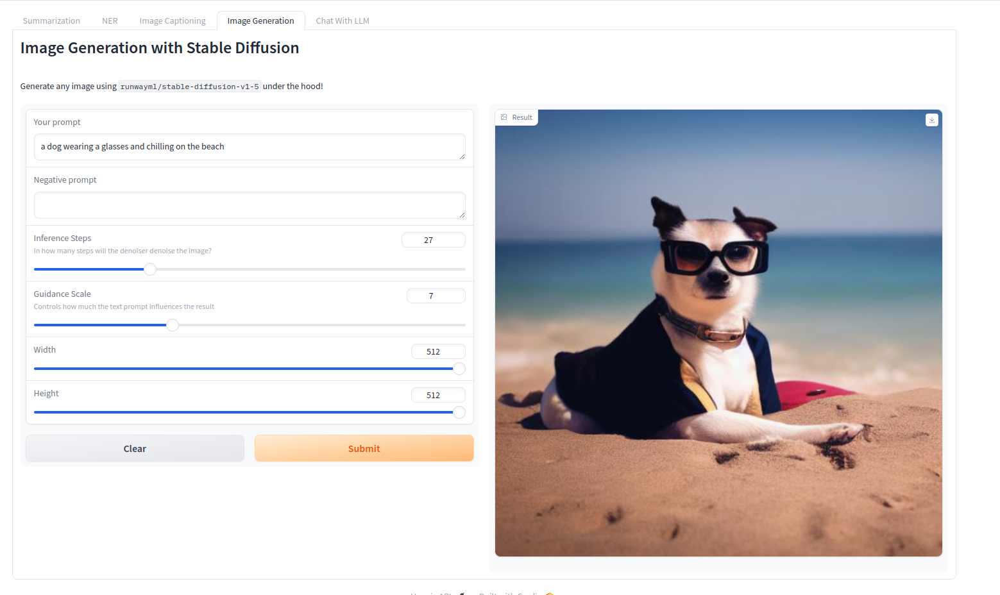

# GenerativeAI Applications Demo with Gradio

This project showcases various AI models integrated with Gradio for interactive demonstrations. It includes functionalities like text summarization, named entity recognition (NER), image captioning, image generation, and chat with a language model (LLM).

## Description

This project provides a user-friendly interface for interacting with different open-source AI models from HuggingFace through Inferencee API(serverless). Users can input text, upload images, or provide prompts to generate responses from the models. The interface is designed to be intuitive and accessible, allowing users to explore the capabilities of the models easily.

## Features

- **Text Summarization**: Summarize any text using the [`Falconsai/text_summarization`](https://huggingface.co/Falconsai/text_summarization) model.

    
- **Named Entity Recognition (NER)**: Find entities in text using the `[dslim/bert-base-NER`](https://huggingface.co/dslim/bert-base-NER) model.

    
- **Image Captioning**: Generate captions for images using the [`Salesforce/blip-image-captioning-basehttps://huggingface.co/Salesforce/blip-image-captioning-base`]() model.

    
- **Image Generation**: Generate images using the [`runwayml/stable-diffusion-v1-5`](https://huggingface.co/runwayml/stable-diffusion-v1-5) model.

    
- **Chat with Language Model (LLM)**: Engage in conversation with a language model using the [`tiiuae/falcon-7b-instruct`](https://huggingface.co/tiiuae/falcon-7b-instruct) model.

    

## Installation

1. Clone the repository

2. Install the required Python packages:
    ```bash
    pip install -r requirements.txt
    ```

3. Obtain API keys:
    - [Huggingface API key](https://huggingface.co/settings/tokens) for accessing the text summarization, NER, and chat with LLM functionalities.
    - Optionally, other API keys for specific models used in the project.

4. Create `.env` file and  add your API key(s):
   ```bash
   HUGGINGFACE_API_KEY="YOUR API KEY"
   ```

5. Run the demo:
    ```bash
    python main.py
    ```
6. Access the demo interface by opening the provided URL in a web browser.


## Usage

- Input text or upload images to interact with the various AI models.
- Follow the instructions on the interface to explore different functionalities.
- Experiment with different prompts and parameters to generate desired outputs.
